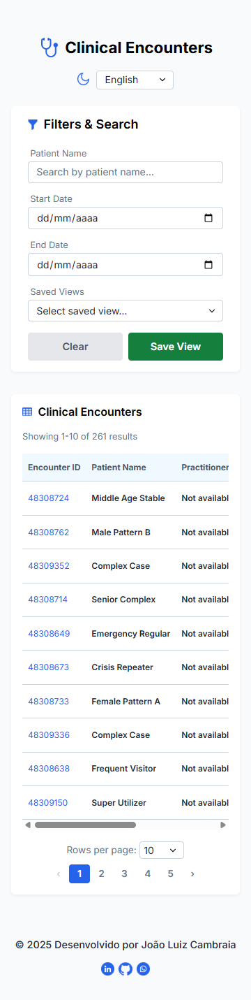

# Desafio Técnico Frontend - Encontros Clínicos


Bem-vindo ao repositório do desafio técnico! Este projeto é uma aplicação web frontend desenvolvida em React para listar, filtrar e visualizar detalhes de encontros clínicos, consumindo uma API pública.

A aplicação foi projetada com foco em boas práticas de desenvolvimento, como código limpo, componentes reutilizáveis, gerenciamento de estado eficiente e uma experiência de usuário intuitiva e responsiva.

## Sobre o Projeto

Este projeto foi desenvolvido como parte de um desafio técnico, demonstrando competências em desenvolvimento frontend moderno com React. A aplicação consome uma API FHIR pública para exibir informações de encontros clínicos de forma organizada e intuitiva.

## Deploy da Aplicação

A aplicação está hospedada no Vercel com deploy automático a cada push na branch main.

**[Acessar aplicação em produção](https://fhir-encounters-frontend.vercel.app/)**

## Demonstração

### Screenshots

#### 1. Visão Geral da Aplicação

<table>
  <tr>
    <td>
      
      <br>
      <em>Visão Geral da Aplicação</em>
    </td>
  </tr>
</table>

#### 2. Sistema de Temas

##### Tema Claro

<table>
  <tr>
    <td>
      
      <br>
      <em>Tema Claro</em>
    </td>
  </tr>
</table>

##### Tema Escuro

<table>
  <tr>
    <td>
      
      <br>
      <em>Tema Escuro</em>
    </td>
  </tr>
</table>

#### 3. Modais e Detalhes

##### Tema Claro

<table>
  <tr>
    <td>
      
      <br>
      <em>Modal de Detalhes - Tema Claro</em>
    </td>
  </tr>
</table>

##### Tema Escuro

<table>
  <tr>
    <td>
      
      <br>
      <em>Modal de Detalhes - Tema Escuro</em>
    </td>
  </tr>
</table>

#### 4. Modal de Salvar Visualização

<table>
  <tr>
    <td>
      
      <br>
      <em>Modal de Salvar Visualizações</em>
    </td>
  </tr>
</table>

#### 5. Estados de Loading e Erro

##### Skeleton Loading

<table>
  <tr>
    <td>
      
      <br>
      <em>Skeleton Loading</em>
    </td>
  </tr>
</table>

##### Tratamento de Erro

<table>
  <tr>
    <td>
      
      <br>
      <em>Tratamento de Erro</em>
    </td>
  </tr>
</table>

#### 6. Interface Mobile

<div align="left">
  
  <br>
  <em>Layout totalmente responsivo para dispositivos móveis</em>
</div>

### Gifs

#### 1. Carregamento Inicial

<div align="center">
  
  <br>
  <em>Carregamento inicial com skeleton loading e transição para dados reais</em>
</div>

#### 2. Alternância de Tema

<div align="center">
  
  <br>
  <em>Mudança entre tema claro e escuro em tempo real</em>
</div>

#### 3. Modal de Detalhes

<div align="center">
  
  <br>
  <em>Abertura e visualização de informações completas do encontro clínico</em>
</div>

#### 4. Sistema de Filtros

##### Filtro por Nome do Paciente

<div align="center">
  
  <br>
  <em>Busca por nome do paciente com debounce inteligente</em>
</div>

##### Filtro por Período de Datas

<div align="center">
  
  <br>
  <em>Filtros por período de atendimento (data início e fim)</em>
</div>

#### 5. Navegação e Paginação

##### Navegação por Botões

<div align="center">
  
  <br>
  <em>Navegação entre páginas usando os botões numerados</em>
</div>

##### Alteração de Itens por Página

<div align="center">
  
  <br>
  <em>Mudança da quantidade de itens exibidos por página (10, 25, 50)</em>
</div>

#### 6. Idiomas

<div align="center">
  
  <br>
  <em>Alternância entre Português e Inglês em tempo real</em>
</div>

#### 7. Visualizações Salvas

##### Salvando uma Visualização

<div align="center">
  
  <br>
  <em>Salvando configurações de filtros com nome personalizado</em>
</div>

##### Carregando Visualização Salva

<div align="center">
  
  <br>
  <em>Carregando filtros previamente salvos através do dropdown</em>
</div>

##### Limpando Visualização Salva

<div align="center">
  
  <br>
  <em>Removendo filtros aplicados e retornando ao estado inicial</em>
</div>

## Funcionalidades

Este projeto implementa as seguintes funcionalidades, atendendo a todos os requisitos do desafio e adicionando extras para demonstrar um conhecimento aprofundado:

- **Listagem de Encontros Clínicos:** Exibição paginada de encontros, mostrando ID, nome do paciente, nome do profissional e data de atendimento.

- **Paginação Avançada:** Implementação de paginação real na API, com opções de 10, 25 ou 50 resultados por página. A navegação de páginas é feita através de uma barra numérica que exibe até 5 páginas por vez, permitindo a rolagem para a esquerda ou direita.

- **Detalhes do Encontro:** Ao clicar em um encontro, um modal exibe informações completas e organizadas do encontro, incluindo detalhes do paciente, profissional, data completa, ID e um informativo de disponibilidade para campos ausentes.

- **Sistema de Filtros:** Possibilidade de filtrar a lista de encontros por nome do paciente e um período de datas de atendimento (início e fim) com debounce para otimizar as requisições.

- **Visualizações Salvas:** Os filtros aplicados podem ser salvos com um nome amigável e carregados posteriormente através de um dropdown. Os dados são persistidos no localStorage.

- **Experiência do Usuário (UX):**

  - **Skeleton Loading:** Um efeito de carregamento visual é exibido enquanto os dados da API são buscados.
  - **Tratamento de Erros:** Um modal de erro é exibido caso a requisição à API falhe, com retry automático.
  - **Responsividade:** O layout é totalmente adaptável para dispositivos móveis, tablets e desktops.

- **Acessibilidade & Boas Práticas:**
  - **Tema Dinâmico:** A aplicação possui um tema claro/escuro que pode ser alternado pelo usuário.
  - **Internacionalização:** Suporte a dois idiomas (Português e Inglês).
  - **Metodologia BEM:** A arquitetura CSS segue a metodologia BEM para garantir classes organizadas e de fácil manutenção.

## API e Integração

### Desafios Técnicos e Soluções

A API pública original apresentou instabilidade, retornando dados de forma inconsistente. Após uma análise do problema, optei por utilizar um endpoint mais robusto e previsível:

```
https://hapi.fhir.org/baseR4/Encounter?status=finished&date=ge2025-01-01&_include=Encounter:patient&_include=Encounter:participant
```

### Endpoints Utilizados

- **GET /Encounter** - Lista de encontros clínicos
- **Parâmetros de paginação:** `_count`, `_page`
- **Includes:** `_include=Encounter:patient&_include=Encounter:participant`
- **Filtros:** `status=finished`, `date=ge2025-01-01`

### Tratamento de Erros

- Retry automático em falhas de rede
- Modal de erro com feedback claro ao usuário e possibilidade de nova tentativa

## Como Rodar o Projeto

Siga estas instruções para configurar e executar o projeto em sua máquina local.

### Pré-requisitos

- **Node.js** (versão 16 ou superior)
- **npm** ou **yarn**

### Passo a Passo

1. **Clone o repositório:**

```bash
git clone https://github.com/jlcambraia/fhir-encounters-frontend
cd desafio-encontros-clinicos
```

2. **Instale as dependências:**

```bash
npm install
# ou
yarn install
```

3. **Configure variáveis de ambiente (se necessário):**

```bash
# Crie um arquivo .env.local na raiz do projeto
cp .env.example .env.local
```

4. **Inicie o servidor de desenvolvimento:**

```bash
npm run dev
# ou
yarn dev
```

5. **Acesse a aplicação:**
   Abra seu navegador e acesse `http://localhost:3000`

## Testes Unitários

Implementação de testes unitários focando nas funções críticas da aplicação, especialmente no componente `formatter.js` para garantir a confiabilidade das funções de formatação de dados.

### Executar Testes

```bash
# Executar todos os testes
npm run test
```

## Stack Tecnológica

### Frontend Core

- **React** - Framework principal com hooks modernos
- **Vite** - Build tool e dev server para desenvolvimento rápido
- **JavaScript ES6+** - Linguagem principal com features modernas

### Estilização

- **CSS3** - Estilização nativa com CSS Variables
- **Metodologia BEM** - Arquitetura CSS escalável e maintível
- **CSS Flexbox** - Layout responsivo moderno

### Testes e Qualidade

- **Jest** - Framework de testes unitários
- **ESLint** - Linting para qualidade de código
- **Babel** - Transpilação para compatibilidade

### Deploy e Infraestrutura

- **Vercel** - Hospedagem com deploy automático
- **Git** - Controle de versão

## Arquitetura e Decisões Técnicas

### Gerenciamento de Estado

- **Context API:** Escolhido para evitar prop drilling sem a complexidade do Redux
- **Custom Hooks:** Para lógica reutilizável (useFilters, useTranslations, useModalClose)
- **Estado Local:** Utilizado para componentes específicos

### Otimizações de Performance

- **Memoização:** Otimização de re-renderizações com React.memo quando necessário

### Padrões de Código

- **Componentes Funcionais:** Exclusivamente com hooks
- **Organização por Contexto:** Estrutura modular baseada em funcionalidades
- **Separação de Responsabilidades:** Services, hooks, utils e components bem definidos

## Estrutura do Projeto

A estrutura de arquivos do projeto segue a metodologia BEM e a organização por contexto para manter o código modular e de fácil manutenção:

```
public/
├── favicon.ico
└── logo.png

src/
├── assets/
│   └── icons/
├── components/
│   ├── Encounters/
│   │   ├── components/
│   │   │   ├── EncountersTable/
│   │   │   │   ├── components/
│   │   │   │   │   ├── SkeletonLoading.css
│   │   │   │   │   └── SkeletonLoading.jsx
│   │   │   │   ├── EncountersTable.css
│   │   │   │   └── EncountersTable.jsx
│   │   │   └── Pagination/
│   │   │       ├── Pagination.css
│   │   │       └── Pagination.jsx
│   │   ├── Encounters.css
│   │   └── Encounters.jsx
│   ├── Filters/
│   │   ├── Filters.css
│   │   └── Filters.jsx
│   ├── Footer/
│   │   ├── Footer.css
│   │   └── Footer.jsx
│   ├── Header/
│   │   ├── components/
│   │   │   ├── LanguageSelectButton/
│   │   │   │   ├── LanguageSelectButton.css
│   │   │   │   └── LanguageSelectButton.jsx
│   │   │   └── ThemeButton/
│   │   │       ├── ThemeButton.css
│   │   │       └── ThemeButton.jsx
│   │   ├── Header.css
│   │   └── Header.jsx
│   └── Modals/
│       ├── DetailsModal.css
│       ├── DetailsModal.jsx
│       ├── ErrorModal.css
│       ├── ErrorModal.jsx
│       ├── SaveViewModal.css
│       └── SaveViewModal.jsx
├── contexts/
│   ├── EncountersContext.jsx
│   ├── EncounterProvider.jsx
│   ├── FiltersContext.jsx
│   ├── FiltersProvider.jsx
│   ├── LanguageContext.jsx
│   ├── LanguageProvider.jsx
│   ├── ThemeContext.jsx
│   └── ThemeProvider.jsx
├── hooks/
│   ├── useFilters.js
│   ├── useModalClose.js
│   └── useTranslations.js
├── services/
│   └── api/
│       └── Api.js
├── utils/
│   ├── formatter.test.js
│   ├── formatter.js
│   └── translations.js
├── vendor/
│   ├── fonts/
│   ├── fonts.css
│   └── normalize.css
├── App.css
├── App.jsx
├── index.css
└── main.jsx

# Arquivos de configuração
├── .babelrc
├── .gitignore
├── eslint.config.js
├── index.html
├── jest.config.js
├── package.json
├── README.md
└── vite.config.js
```

## Scripts Disponíveis

| Script            | Descrição                          |
| ----------------- | ---------------------------------- |
| `npm run dev`     | Inicia servidor de desenvolvimento |
| `npm run build`   | Build para produção                |
| `npm run preview` | Preview do build de produção       |
| `npm run test`    | Executa testes unitários           |
| `npm run lint`    | Verifica código com ESLint         |

## Melhorias Futuras

### Próximas Features

- **Excluir Visualizações Salvas:** Funcionalidade para remover visualizações salvas do localStorage
- **Loading do Botão de Salvar:** Estado de loading no modal de visualizações salvas
- **Busca Avançada:** Filtros adicionais por profissional e status
- **Dashboard Analytics:** Métricas e gráficos dos encontros
- **Notificações:** Sistema de alertas para atualizações

### Melhorias Técnicas

- **TypeScript:** Migração para tipagem estática

## Referências e Recursos

- [FHIR API Documentation](https://www.hl7.org/fhir/)
- [React Documentation](https://react.dev/)
- [BEM Methodology](http://getbem.com/)
- [Vite Guide](https://vitejs.dev/guide/)
- [Jest Testing Framework](https://jestjs.io/)
- [Vercel Deployment](https://vercel.com/docs)

## Autor

**João Luiz de Carvalho Cambraia**

- GitHub: [@jlcambraia](https://github.com/jlcambraia)
- LinkedIn: [Meu perfil](https://www.linkedin.com/in/joaoluizcambraia/)
- Email: joaoluiz.cambraia@gmail.com
- WhatsApp: +55 (31) 99611-4022

---

## Agradecimentos

Agradeço a oportunidade de participar deste desafio técnico! Foi uma ótima experiência desenvolver e aplicar as melhores práticas em um projeto prático.

Qualquer feedback é muito bem-vindo.

Um grande abraço a todos!
